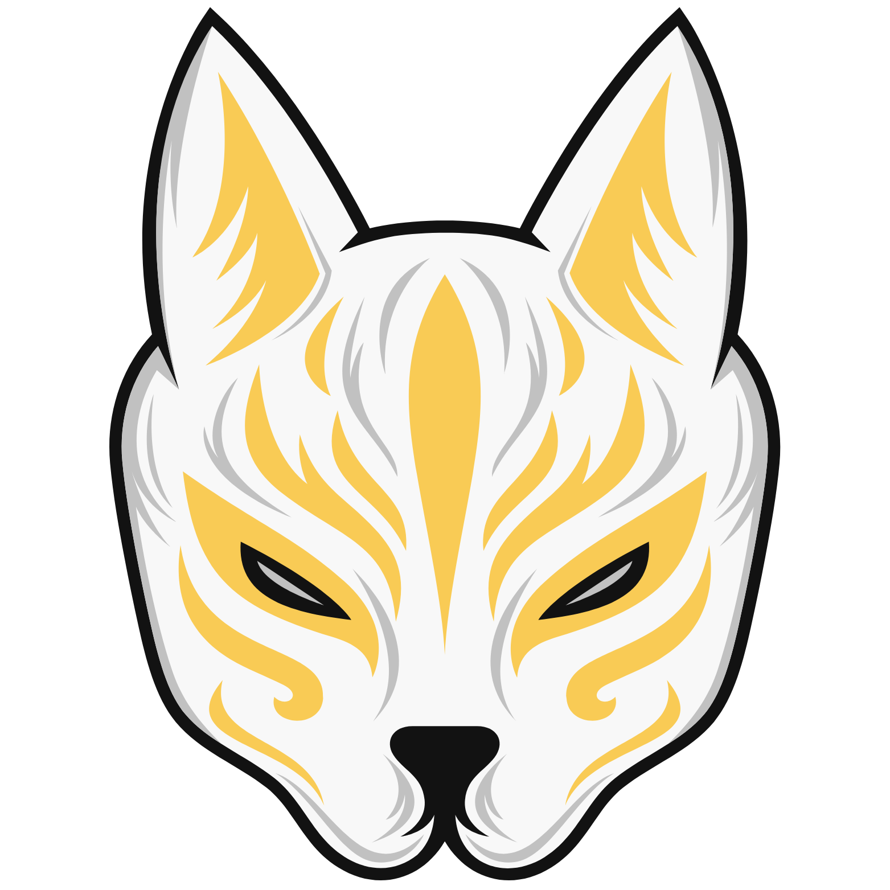

<div align="center">
  
  
  # AnimeDxD
  
  <b>A beautiful Android app for anime & manga fans</b>
  
  <br>
  
  
  
</div>

---

## ✨ Features

🌸 Browse and view anime & manga covers<br>
🎨 Custom UI components & navigation<br>
🔒 Login & authentication screens<br>
🏠 Home, dashboard, and list navigation<br>
⭐ Star rating system for anime/manga<br>
🖼️ Beautiful custom backgrounds & overlays

---

## 🗂️ Project Structure

```
app/
  src/main/java/ac/id/        # Source code
  src/main/res/               # Resources (drawables, layouts, fonts, etc.)
  src/main/AndroidManifest.xml # App manifest
  build.gradle.kts            # Module build config
build.gradle.kts              # Project build config
settings.gradle.kts           # Gradle settings
gradle/                       # Gradle wrapper & versions
build/                        # Build outputs & reports
```

---

## 🚀 Getting Started

1. **Clone the repository:**
   ```sh
   git clone https://github.com/junssekut/AnimeDxD.git
   ```
2. **Open in Android Studio:**
   - Import the project as a Gradle project.
3. **Build and Run:**
   - Use the Gradle wrapper (`./gradlew build`) or Android Studio's build/run buttons.

---

## 📋 Requirements

- Android Studio (latest recommended)
- JDK 11 or higher
- Gradle (wrapper included)

---

## 🤝 Contributing

Contributions are welcome! Fork the repo and submit a pull request.

---

## 📄 License

MIT License

---

## 📬 Contact

For questions or feedback, open an issue or contact the repository owner.

---

## 🙏 Thanks

Special thanks to these amazing people for their contributions:

- Arjuna Andio as Dev Team
- Benedicta Bellarose Christe as Dev Team
- Naomi Indah Anastasya as Dev Team
